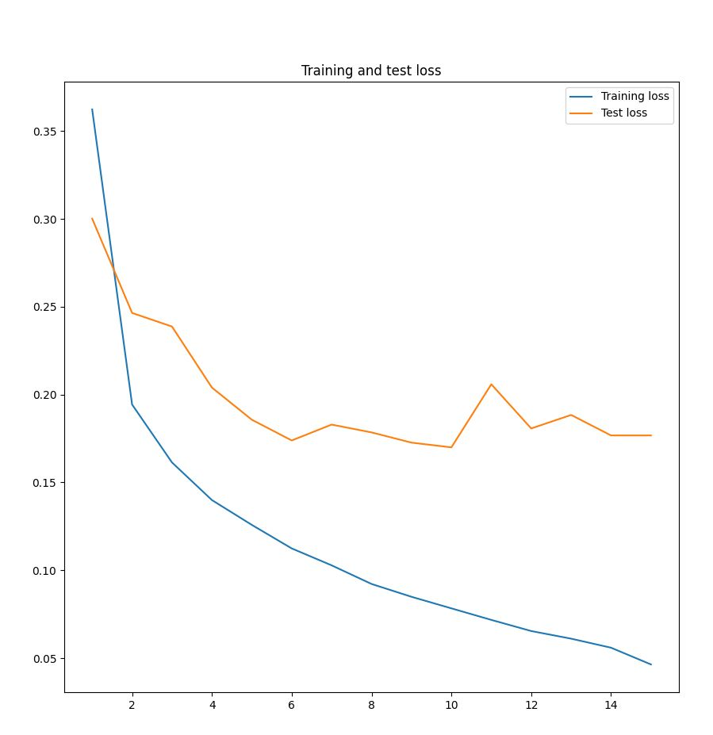

# NLP Module

# About the models

## Sentiment Analysis

We are using a pre-trained model from [HuggingFace](https://huggingface.co/) which uses transformers library to create a pipeline and assign a label. We have a dataset with x number of movie reviews and we can classify those reviews as possitive or negative.

## NER (Named Entity Recognition)

This NER model is trained with a ******big****** dataset of tweets. Once the model is trained, some files regarding the performance of the model will be saved in a folder named `resources` and a plot showing the loss of the training data and dev data will be shown. You can see the the result of training through the whole dataset in the image below.



However, you can run this model by yourself specifiying how many tweets you want to use to train the model. You can learn more about this on the **************************[configuration**************************](https://www.notion.so/NLP-Module-77c532c0a893413681b6cc4187e24a0f) section of this readme.

## API translation evaluation

This model aims to evaluate two translation API’s using the BLEU score as a metric. There is an english dataset translated to spanish using both [translate-plus](https://rapidapi.com/sohailglt/api/translate-plus) and [rapid-translate-multi-traduction](https://rapidapi.com/sibaridev/api/rapid-translate-multi-traduction) API’s.

# Configuration

This project is configured using an `.env` file which structure can be seen in the file named `.iAmNotAnEnv`.

## Sentiment Analysis Model

This model can not be configured.

## NER Model

- `N_EXAMPLES_TO_TRAIN` is a parameter used to let the model know how many examples it will used to train. This automatically creates a new file with the desired examples.
- `NER_EPOCHS` is a parameter usted to let the model know how many epoch it will use to train.
- `NER_LEARNING_RATE` is the basically the learning rate the ner model will use to train.

## Translation Model

This model requires a `RAPID_API_KEY` that you can obtain by creating an account on [RapidApi](https://rapidapi.com/hub).

You have to suscribe to [translate-plus](https://rapidapi.com/sohailglt/api/translate-plus) and [rapid-translate-multi-traduction](https://rapidapi.com/sibaridev/api/rapid-translate-multi-traduction) API’s once you have created your [RapidApi](https://rapidapi.com/hub) account.

Please note that these are ********freemium******** API’s, so there is a request limit. The code may break if you reach this limit.

## Requirements

You need to install the following dependencies in order to run the code:

```
transformers
torch
flair
python-dotenv
pandas
matplotlib
requests
nltk
```

However, you can install them from console using `pip install -r requirements.txt.`

# Testing the models

You can test all the models by running the `run_me.py` file using your favorite IDE or by typing `python run_me.py` in console. This will script will guide you step by step through each model and will display relevant information after finishing each model.